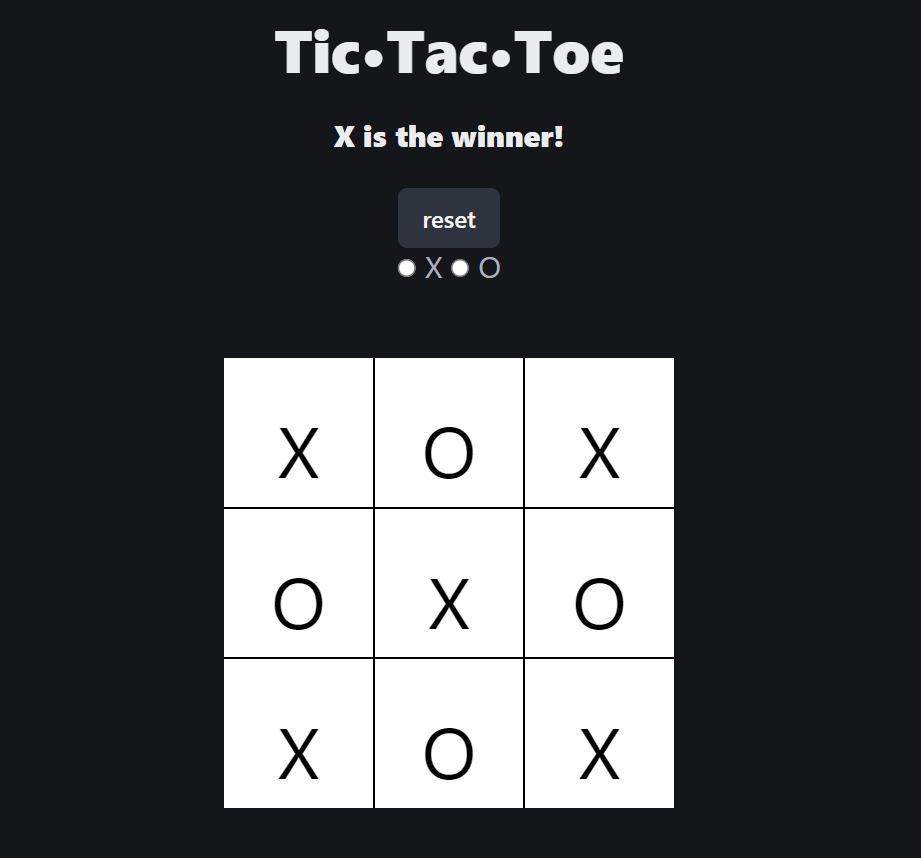

# GameCenter

# Group Do: Designing your MVP

## Description
    The main goal of this project was to make a function MVP of the page we design and explore. Our group decided to work together to make a GameCenter. This GameCenter include two games since we were two people. The two games were TicTacToe and ConnectFour. each of us were able to help with the home page and the stats page and we were able to explore making the games and branch out if we got stuck.

    Example of the landing page:

## TicTacToe
  
Javascript examples that were used to create the game

```js
    function setMark(e) {
        mark = e.target.value;
        msg.textContent = mark + ', click on a square to make your move!';
        choice.classList.add('good-luck');
        e.target.checked = false;
        buildGame();
    }

    function playerTurn(e) { 
        console.log(e.target.textContent)
        if (e.target.textContent == '__') {
            e.target.textContent = mark;
            checkRow();
            switchMark();
            computerTurn();
        }
    }

    function buildGame() {
        for (let i = 1; i <= 9; i++) {
            let cell = document.createElement('li');
            cell.id = 'c' + i;
            cell.textContent = '__'
            cell.addEventListener('click', playerTurn, false);
            grid.appendChild(cell);
        }

        cells = Array.prototype.slice.call(grid.getElementsByTagName('li'));
    }
```
This was the corresponding HTML that linked to the Javascript to create the game. 
```html
      <div class="container">
        <div class="row text-center" id="intro section">
          <h1 class="title is-2 has-text-centered">Tic•Tac•Toe</h1>
          <h2 class="title is-5 has-text-centered" id="message">Choose X or O</h2>
          <div class="has-text-centered">
          <button id= 'reset' class="button is-dark has">reset</button>
        </div>
          <form action="#">
            <fieldset id="choose" class="has-text-centered subtitle is-5">
              <input type="radio" name="player-choice" id="player-choice-1" value="X" />
              <label for="player-choice-1">X</label>
              <input type="radio" name="player-choice" id="player-choice-2" value="O" />
              <label for="player-choice-2">O</label>
            </fieldset>
      </div>
      <div class="grid" id="grid-section">
        <ul id="grid">
        </ul>
      </div>
```
## Presentation

    Click here to link to GameCenter presentation...  https://docs.google.com/presentation/d/17jB1vOyptAwx6cfDuL8DgnaaRicvQS79szWF59XzAlY/edit?usp=sharing

## Learning Points
    In this project we were able to learn what it takes to start a webpage and see it all the way to the MVP or minimum viable product. This will be a crucial lesson for when we are able to move on to working in the field moving forward. 

### Group 10
```
This project was made by: 
Spencer Durfey & Matthew Holmes
```
